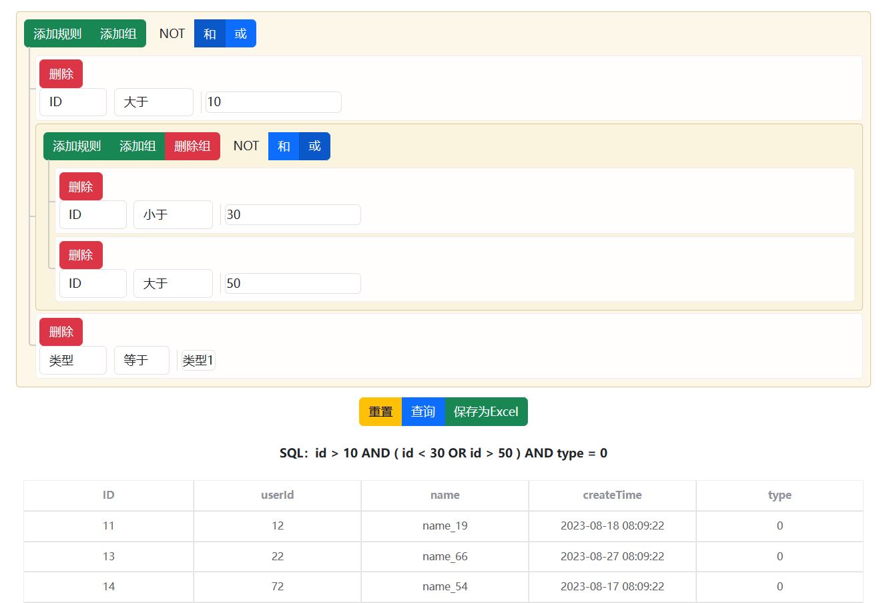
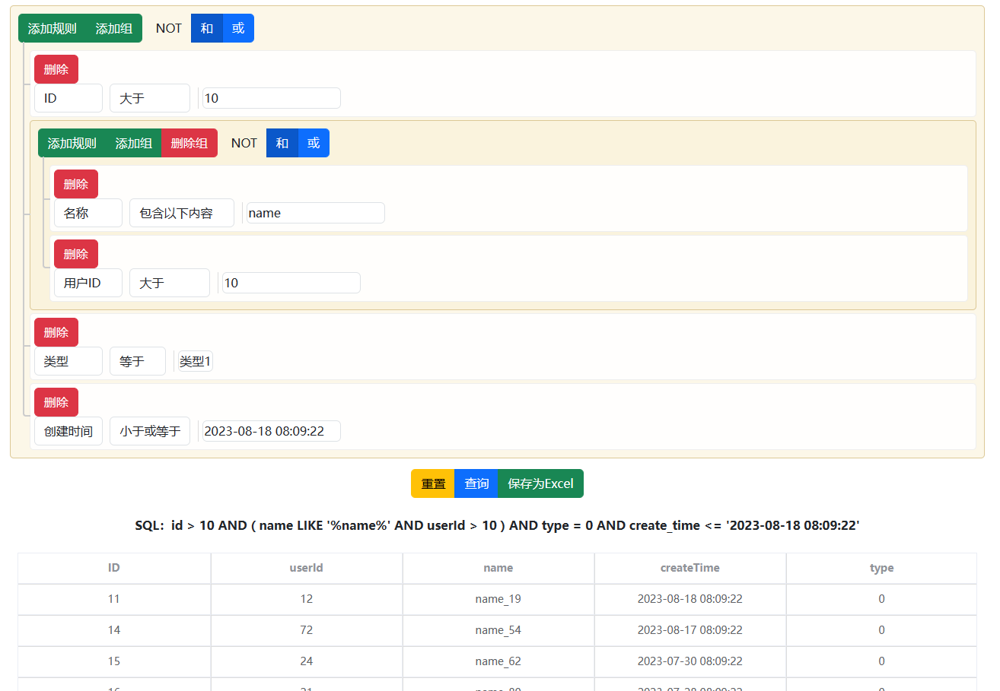

# SQL 过滤器

## 一、目录

[TOC]

## 二、介绍

这是一个 SQL 过滤筛选器，用于查询和过滤数据库中的数据。

技术：Vue + Element + Spring boot + Mybatis plus + MySQL

实现：

1. 使用 Vue 和 Element 编写前端页面

2. 使用 Spring boot 和 Mybatis plus 实现后端业务逻辑

3. 使用 MySQL 数据库进行数据管理

4. 使用 [hutool工具包](https://www.hutool.cn/) 进行参数校验

5. 使用 lombok 插件替换 get、set 方法

6. 使用 [QueryBuilder](https://querybuilder.js.org/) 构建 SQL 过滤筛选器

## 三、效果





## 四、数据表

```sql
CREATE TABLE act_card_result (
  id BIGINT(20) NOT NULL AUTO_INCREMENT PRIMARY KEY,
  userId INT NOT NULL,
  name VARCHAR(50) NOT NULL,
  createTime TIMESTAMP NOT NULL DEFAULT CURRENT_TIMESTAMP COMMENT '创建时间',
  type TINYINT(1) NOT NULL
);

INSERT INTO act_card_result (userId, name, createTime, type)
SELECT 
    FLOOR(RAND() * 1000) + 1,
    CONCAT('User', FLOOR(RAND() * 100)),
    DATE_ADD('2023-06-22 00:00:00', INTERVAL FLOOR(RAND() * 365) DAY),
    FLOOR(RAND() * 2)
FROM
    (SELECT 1 UNION SELECT 2 UNION SELECT 3 UNION SELECT 4 UNION SELECT 5) AS t1,
    (SELECT 1 UNION SELECT 2 UNION SELECT 3 UNION SELECT 4 UNION SELECT 5) AS t2
LIMIT 100;
```

## 五、后端

### 1、基本类介绍

| 类            | 作用                           |
| ------------- | ------------------------------ |
| ActCardResult | 实体类                         |
| SQLDto        | 前端请求参数                   |
| Result        | 统一返回结果                   |
| CorsConfig    | 跨域配置（不用，测试时使用的） |

### 2、前端请求的参数

```java
@Data
public class SQLDto {
    private String sql;
    private String sqlTemplate;
    private List<String> parameters;
}
```

示例：

```json
sqlDto = {
  "sql": "id = 1 AND ( type = 0 ) ",
  "sqlTemplate": "id = ? AND ( type = ? ) ",
  "parameters": [
    1,
    0
  ]
}
```

### 3、SQL 过滤筛选器功能实现

#### 3.1 方法介绍

| 方法                                                         | 介绍                                      |
| ------------------------------------------------------------ | ----------------------------------------- |
| private String[] cutSqlTemplate(String sqlTemplate)          | 截取 sqlTemplate 获取属性以备进行参数校验 |
| private Map<String,String> getClassTypeReflect(Class c)      | 使用反射获取类的属性及类型，用于参数校验  |
| private boolean verifySql(SQLDto sqlDto)                     | 遍历参数及其类型，检查是否需要校验        |
| private boolean verifyParameter(String type,String parameter) | 参数校验，检查参数是否合理                |
| public Result queryBySqlDto(SQLDto sqlDto)                   | 根据 sql 查询数据库                       |

#### 3.2 截取 sqlTemplate

通过空格分隔 sqlTemplate 获取属性名；

```java
    /**
     * 通过空格分割字符串
     * @param sqlTemplate
     * @return
     */
    private String[] cutSqlTemplate(String sqlTemplate){
        // \\s+ 表示匹配一个或多个连续的空格字符。
        return sqlTemplate.split("\\s+");
    }
```

#### 3.3 保存实体类属性及其类型为Map

##### 函数实现

该函数主要通过以下步骤获取实体类的属性及类型：

1. 获取实体类的所有属性：
   - 调用 `ActCardResult.class.getDeclaredFields()` 方法获取实体类的所有属性；
   - 返回值为 `Field` 数组，每个数组元素包含一个属性的信息（名称、类型、访问修饰符等）。
2. 遍历属性数组，获取每个属性的名称和类型：
   - 使用 `field.getName()` 获取属性名称；
   - 使用 `field.getType().getSimpleName()` 获取属性类型的简单名称，并将其作为 `Map` 的值；
   - 将属性名作为 `Map` 的键，类型名作为 `Map` 的值。

##### 返回值

该函数的返回值类型为 `Map<String, String>`，表示实体类的属性及类型映射关系。其中，`Map` 的 key 为属性名，value 为属性类型的简单字符串形式。

```java
    /**
     * 使用反射获取类的属性及类型
     * @return
     */
    private Map<String,String> getClassTypeReflect(Class c){
        Map<String,String> map = new HashMap<>();
        Field[] fields = c.getDeclaredFields();
        for (Field field : fields) {
            String fieldName = field.getName();
            String fieldType = field.getType().getSimpleName();
            map.put(fieldName, fieldType);
        }
        return map;
    }
```

#### 3.4 遍历参数及其类型

##### 函数实现

1. 获取 SQL 语句中的参数列表。
2. 对 SQL 语句进行切割，获取参数名。
3. 获取对应实体类中的属性类型。
4. 遍历 SQL 中的参数并校验是否符合规范，如果不符合就返回 false，否则返回 true。

```java
    private boolean verifySql(SQLDto sqlDto){
        // 参数
        List<String> parameters = sqlDto.getParameters();
        int size = parameters.size();
        log.info("【parameters】{}",parameters);
        int count = 0; // 记录当前的参数
        // 切割字符串
        String[] sqlTemplates = cutSqlTemplate(sqlDto.getSqlTemplate());
        // 获取实体类的属性及参数
        Map<String, String> classType = getClassTypeReflect(ActCardResult.class);
        // 遍历sqlTemplates，以其元素为map的key，如果存在，就进行处理
        // 如果是 BETWEEN ，那么他会有两个参数
        // 记录上一个值类型，在template.equals("BETWEEN")时使用
        String classWithBETTWEEN = null;
        for (String template : sqlTemplates){
            if (template.equals("NULL")){
                count--;
            }
            // 如果存在BETWEEN，继续校验下一个参数
            if (template.equals("BETWEEN")){
                if (count<size){
                    String parameter = parameters.get(count);
                    boolean b = verifyParameter(classWithBETTWEEN, parameter);
                    if (Validator.isFalse(b)){
                        return false;
                    }
                    count++;
                }
                continue;
            }
            
            if (classType.containsKey(template)){
                String type = classType.get(template);
                classWithBETTWEEN = type;
                log.info("【type】{}",type);
                // 获取参数
                if (count<size){
                    String parameter = parameters.get(count);
                    log.info("【parameter】{}", parameter);
                    // TODO 参数校验
                    boolean b = verifyParameter(type, parameter);
                    if (Validator.isFalse(b)){
                        return false;
                    }
                    log.info("【参数校验】");
                    count++;
                }
            }
        }
        return true;
    }
```

#### 3.5 参数校验

##### 函数实现

1. 判断传入的 `type` 和 `parameter` 是否为空，若为空则直接返回 `false`。
2. 创建一个 `Map<String, Predicate<String>>` 对象 `validators`，其中存放各个参数类型对应的校验方法。比如，对于 `String` 类型的参数，使用 `StrUtil::isNotBlank` 方法进行校验。
3. 根据传入的 `type` 参数获取对应校验方法，并将该校验方法保存在一个 `Predicate<String>` 对象中。
4. 判断获取的校验方法是否为空，如果为空，则表明该参数类型不属于系统预定义的几种类型，此时直接返回 `true`。
5. 使用获取到的校验方法对传入的 `parameter` 进行校验，并返回校验方法的返回值。

```java
    /**
     * 参数校验
     * @param type
     * @param parameter
     * @return
     */
    private boolean verifyParameter(String type,String parameter){
        if (StrUtil.isBlank(type) || StrUtil.isBlank(parameter)) {
            return false;
        }

        Map<String, Predicate<String>> validators = new HashMap<>();
        validators.put("String", StrUtil::isNotBlank);
        validators.put("Integer", NumberUtil::isInteger);
        validators.put("Long", NumberUtil::isLong);
        validators.put("Double", NumberUtil::isDouble);
        validators.put("Date", s -> {
            DateFormat df = new SimpleDateFormat("yyyy-MM-dd");
            df.setLenient(false);
            try {
                df.parse(s);
                return true;
            } catch (ParseException e) {
                // 如果解析失败，则返回false
                return false;
            }
        });
        Predicate<String> validator = validators.get(type);
        if (validator == null) {
            // 其他类型的参数校验
            return true;
        }
        return validator.test(parameter);
    }
```

#### 3.6 查询数据库

##### 函数实现

1. 进行参数校验：调用 `verifySql` 函数对传入的参数进行验证。如果验证不通过，则返回错误提示信息。
2. 执行 SQL 查询：通过 `actCardResultMapper` 执行 SQL 查询。根据传入的 SQL 模板创建一个 `QueryWrapper` 对象 `wrapper`，并调用 `apply` 方法将模板应用于 `wrapper`，然后使用 `selectList` 方法执行查询，并将查询结果保存到一个 `List<ActCardResult>` 对象中。
3. 返回查询结果：将查询结果对象打包成一个 `Result` 对象，并将其返回。

```java
    @Override
    public Result queryBySqlDto(SQLDto sqlDto) {
        // 参数校验
        boolean b = verifySql(sqlDto);
        // 使用 hutool 校验是否为 true
        if (Validator.isFalse(b)){
            return Result.fail("参数错误");
        }
        log.info("【SQLDto】{}",sqlDto);
        QueryWrapper<ActCardResult> wrapper = new QueryWrapper<>();
        wrapper.apply(sqlDto.getSql());
        List<ActCardResult> actCardResultList = actCardResultMapper.selectList(wrapper);
        System.out.println(actCardResultList);
        return Result.ok(actCardResultList,"获取成功！");
    }
```

### 3.7 控制器类

```java
@Slf4j
@RestController
@RequestMapping("/actCardResult")
public class ActCardResultController {
    
    @Autowired
    private ActCardResultService actCardResultService;

    @PostMapping("/queryBuilder")
    public Result queryBySql(@RequestBody SQLDto sqlDto){
        return actCardResultService.queryBySqlDto(sqlDto);
    }
}
```

## 六、前端

### 1、queryBuilder的Filters

 filters 数组中定义了五个过滤条件：ID、用户ID、名称、创建时间和类型。

```js
  filters: [{
          id: 'id',
          label: 'ID',
          type: 'integer',
          operators: ['equal', 'not_equal', 'less', 'less_or_equal', 'greater', 'greater_or_equal', 'in', 'not_in']
      }, {
          id: 'userId',
          label: '用户ID',
          type: 'integer',
          operators: ['equal', 'not_equal', 'less', 'less_or_equal', 'greater', 'greater_or_equal', 'in', 'not_in']
      }, {
          id: 'name',
          label: '名称',
          type: 'string',
          operators: ['equal', 'not_equal', 'contains', 'not_contains', 'starts_with', 'ends_with']
      }, {
          id: 'createTime',
          label: '创建时间',
          type: 'date',
          operators: ['between', 'not_between', 'less', 'less_or_equal', 'greater', 'greater_or_equal', 'is_null', 'is_not_null'],
          validation: {
          format: 'yyyy-mm-dd hh:ii:ss'
      }
      }, {
          id: 'type',
          label: '类型',
          type: 'integer',
          input: 'select',
          values: {
              0: '类型1',
              1: '类型2'
          },
          operators: ['equal', 'not_equal']
  }],
```

### 2、vue 方法

| 方法                 | 说明                                                         |
| -------------------- | ------------------------------------------------------------ |
| setDefault()         | 修改 queryBuilder 的查询调节为默认值，这里是 **id IS NOT NULL** |
| querySQL()           | 根据 queryBuilder 的 SQL 使用 axios 进行查询                 |
| exportTableToExcel() | 将查询结果输出为 excel 文件                                  |

### 3、HTML

```html
<!DOCTYPE html>
<html lang="en">
<head>
    <meta charset="UTF-8">
    <meta name="viewport" content="width=device-width, initial-scale=1.0">
    <title>Document</title>
    <!-- <link rel="stylesheet" href="./static/css/element.css" /> -->
    <link rel="stylesheet" href="./static/css/element-plus@2.3.7.css" />
    <!-- <link rel="stylesheet" href="./static/css/element-ui@2.15.13.css" /> -->
    <script src="./static/js/vue@3.js"></script>
    <!-- <script src="./static/js/element-plus.js"></script> -->
    <script src="./static/js/element-plus@2.3.7.js"></script>
    <!-- <script src="./static/js/element-ui@2.15.13.js"></script> -->
    <script src="./static/js/axios.min.js"></script>
    <script src="./static/js/icon-element.js"></script>
    <script src="./static/js/jquery-3.7.0.js"></script>

    <script src="./static/js/1.0.0_jquery-extendext.js"></script>
    <script src="./static/js/doT.js"></script>
    <link rel="stylesheet" href="./static/css/query-builder.default.min.css">
    <script src="./static/js/query-builder.min.js"></script>
    <link rel="stylesheet" href="./static/css/bootstrap.min.css">
    <script src="./static/js/bootstrap.min.js"></script>
    <script src="./static/js/query-builder.zh-CN.js"></script>
    <script src="./static/js/sql-parser.js"></script>
    <script src="./static/js/moment.min.js"></script>
    <link rel="stylesheet" href="index.css">
    <!-- 导出excel -->
    <script src="./static/js/dist_xlsx.full.min.js"></script>
</head>

<body>
    <br>
    <div id="builder-basic" class="query-builder form-inline query-build"></div>
    <div id="app">
        <div>
            <div class="btn-group">
                <button @click="setDefault" class="btn btn-warning reset" data-target="basic">重置</button>
                <button @click="querySQL" class="btn btn-primary parse-json" data-target="basic">查询</button>
                <button class="btn btn-success set-json" data-target="basic" @click="exportTableToExcel()">保存为Excel</button>
            </div>
        </div>
        <br>
        <div>
            <strong v-if="sql!=null">SQL：{{sql}}</strong>
        </div>
        <br>
        <el-table
            :data="actCardResults"
            border
            style="width: 100%">
            <el-table-column
                v-for="h in headers" :key="h.prop"
                :prop="h.prop"
                :label="h.text"
        
                :align="h.align"
            >
            </el-table-column>
        </el-table>
    </div>

    <script src="index.js"></script>
    <script>

        let reqUrl = "http://127.0.0.1"
        // let reqUrl = ""
        const App = {
            data() {
                return {
                    sql: null,
                    actCardResults: null,
                    headers: [
                        {prop: "id", text: "ID", width: 0, align: "center"},
                        {prop: "userId", text: "userId", width: 0, align: "center"},
                        {prop: "name", text: "name", width: 0, align: "center"},
                        {prop: "createTime", text: "createTime", width: 0, align: "center"},
                        {prop: "type", text: "type", width: 0, align: "center"}
                    ],
                    sqlDto: {
                        sql: null,
                        sqlTemplate: null,
                        parameters: []
                    }
                }
            },
            methods: {
                setDefault() {
                    $('#builder-basic').queryBuilder('setRules', rules_basic);
                },
                querySQL() {
                    let that = this;
                    // 获取 sql
                    var result = $('#builder-basic').queryBuilder('getSQL', null);
                    // 获取 sqlTemplate 和 parameters
                    var result_question_mark = $('#builder-basic').queryBuilder('getSQL', 'question_mark');
                    // 将获取到的 sql 存储到组件实例的属性中
                    this.sql = result.sql
                    // 将获取到的 sql 模板、参数存储到 sqlDto 对象中的属性中
                    this.sqlDto.sql = result.sql
                    this.sqlDto.sqlTemplate = result_question_mark.sql
                    this.sqlDto.parameters = result_question_mark.params   
                    // 发起异步请求，查询符合条件的数据
                    axios.post(reqUrl + "/actCardResult/queryBuilder",this.sqlDto)
                        .then(res => {
                            if(res.data.errorMsg!=null) {
                                alert("参数错误！")
                            }else {
                                that.actCardResults = res.data.data
                            }
                            
                        })
                        .catch(err => {
                            console.log(err);
                        });
                },
                exportTableToExcel() {
                    // 获取 el-table 中的 HTML 元素
                    let table = document.querySelector('.el-table__body-wrapper table');

                    // 使用 xlsx-style 将 HTML 表格转换为工作簿对象（Workbook Object）
                    let wb = XLSX.utils.table_to_book(table, {sheet:"Sheet Name"});

                    // 将工作簿对象写入 Excel 文件，并下载该文件
                    XLSX.writeFile(wb, 'mytable.xlsx');
                }

            },
            created() {
                
            },
            mounted() {

            }
        };
        const app = Vue.createApp(App);
        app.use(ElementPlus);
        app.mount("#app");

    </script>
</body>
</html>
```

### 4、JS

```js
var rules_basic = {
  condition: 'AND',
  rules: [{
      id: 'id',
      operator: 'is_not_null'
  }]
};

$('#builder-basic').queryBuilder({
  plugins: [
      'bt-tooltip-errors',
      'not-group'
  ],
  
  filters: [{
          id: 'id',
          label: 'ID',
          type: 'integer',
          operators: ['equal', 'not_equal', 'less', 'less_or_equal', 'greater', 'greater_or_equal', 'in', 'not_in']
      }, {
          id: 'userId',
          label: '用户ID',
          type: 'integer',
          operators: ['equal', 'not_equal', 'less', 'less_or_equal', 'greater', 'greater_or_equal', 'in', 'not_in']
      }, {
          id: 'name',
          label: '名称',
          type: 'string',
          operators: ['equal', 'not_equal', 'contains', 'not_contains', 'starts_with', 'ends_with']
      }, {
          id: 'createTime',
          label: '创建时间',
          type: 'date',
          operators: ['between', 'not_between', 'less', 'less_or_equal', 'greater', 'greater_or_equal', 'is_null', 'is_not_null'],
          validation: {
          format: 'yyyy-mm-dd hh:ii:ss'
      }
      }, {
          id: 'type',
          label: '类型',
          type: 'integer',
          input: 'select',
          values: {
              0: '类型1',
              1: '类型2'
          },
          operators: ['equal', 'not_equal']
  }],

  rules: rules_basic
});
```

### 5、CSS

```css
#app {
    width: 70%;
    margin: auto;
    padding: 10px;
    text-align: center;
}
.query-build {
    width: 70%;
    margin: 0 auto;
}
@media (max-width: 768px) {
    #app {
        width: 100%;
        margin: auto;
        padding: 10px;
        text-align: center;
    }
    .query-build {
        width: 100%;
        margin: 0 auto;
    }
}


/* 设置表格边框和间距 */
table {
    border-collapse: collapse;
    border-spacing: 0;
}

/* 设置表头的样式 */
th {
    background-color: #f2f2f2;
    font-weight: bold;
    text-align: left;
    padding: 8px;
    border: 1px solid #ddd;
}

/* 设置数据单元格的样式 */
td {
    padding: 8px;
    border: 1px solid #ddd;
}

/* 设置鼠标悬停时行的背景色 */
tr:hover {
    background-color: #f5f5f5;
}


```


