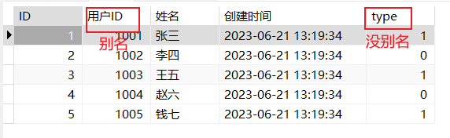
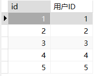
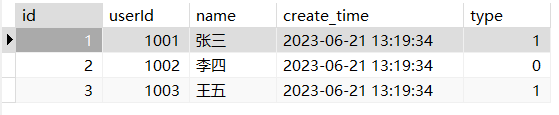
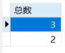

# SQL

## act_card_result 数据表（db数据库）

```java
CREATE TABLE act_card_result (
  id BIGINT(20) NOT NULL AUTO_INCREMENT PRIMARY KEY,
  userId INT NOT NULL,
  name VARCHAR(50) NOT NULL,
  create_time TIMESTAMP NOT NULL DEFAULT CURRENT_TIMESTAMP COMMENT '创建时间',
  type TINYINT(1) NOT NULL
);

INSERT INTO act_card_result (userId, name, type) VALUES
(1001, '张三', 1),
(1002, '李四', 0),
(1003, '王五', 1),
(1004, '赵六', 0),
(1005, '钱七', 1);
```

## 单表查询

查询语句基本结构：`SELECT`、`FROM` 和 `WHERE`

## 一、投影运算

### 1. 查询指定列（SELECT、FROM）

```sql
SELECT id, userId, name, create_time, type 
FROM act_card_result;
```

### 2. 消除重复元组（DISTINCT）

```sql
SELECT DISTINCT type
FROM act_card_result;
```

### 3. 查询所有列（*）

```sql
SELECT * 
FROM act_card_result;
-- 或（查询指定列）（同1）
SELECT id, userId, name, create_time, type 
FROM act_card_result;
```

### 4. 给属性列取别名（AS）

```sql
SELECT id ID, userId 用户ID, name 姓名, create_time 创建时间, type 
FROM act_card_result;
-- 或（使用 AS 关键字）
SELECT id AS ID, userId AS 用户ID, name AS 姓名, create_time AS 创建时间, type 
FROM act_card_result;
```



### 5. 查询经过计算的列

SELECT 子句可以使用属性、常数、函数和表达式。

```sql
SELECT id, userId - 1000 用户ID
FROM act_card_result;
```



## 二、选择运算

| 选择运算       | 条件运算符                 |
| -------------- | -------------------------- |
| 比较运算       | >, >=, <, <=, =, <>(或 !=) |
| 范围运算       | BETWEEN ··· AND            |
| 集合运算       | IN                         |
| 空值查询       | IS null                    |
| 字符串匹配查询 | IKE                        |
| 逻辑查询       | AND, OR, NOT               |

### 1. 比较运算

```sql
SELECT *
FROM act_card_result
WHERE YEAR(CURDATE()) <= YEAR(create_time);
-- CURDATE()：获取当前日期
-- YEAR()：获取年份
```

### 2. 范围查询

```sql
SELECT *
FROM act_card_result
WHERE userId BETWEEN 1001 AND 1003;
-- 或（NOT）
SELECT *
FROM act_card_result
WHERE userId NOT BETWEEN 1004 AND 1005;
```



### 3. 集合查询

```sql
SELECT *
FROM act_card_result
WHERE userId IN(1001,1002,1003);
-- 或（NOT）
SELECT *
FROM act_card_result
WHERE userId NOT IN(1004,1005);
```

### 4. 空值查询

```sql
SELECT *
FROM act_card_result
WHERE userId IS NOT NULL;
```

### 5. 字符查询匹配

语法格式：[NOT] LIKE <匹配字符串> [ESCAPE <换码字符>]

| 通配符 | 作用                              |
| ------ | --------------------------------- |
| %      | 表示任意长度（0个或多个）的字符串 |
| _      | 表示任意一个字符                  |

注意：

- 匹配字符串必须用一对引号括起来；
- 在中文 SQL Server 中，如果匹配字符串为汉字，则一个下划线代表一个汉字，如果是西文，则一个下划线代表一个字符；
- 如果匹配字符串中不含有 %  或 _ ，则 LIKE 与比较运算符 “=” 的查询结果一样；
- ESCAPE '\\' 后面跟的是换码字符，这样紧跟在 \ 后面的 **_ ** 或 **%** 就不是通配符，也可以使用 # 等代替 \ 作为缓慢字符。

```sql
SELECT *
FROM act_card_result
WHERE name LIKE '\%张三%';
-- 在 MySQL 中使用换码字符/转义字符（\），并不需要使用 ESCAPE
```

### 6. 逻辑运算

SQL 提供符合条件运算，使用 AND、OR 和 NOT 逻辑运算符分别实现逻辑与、逻辑或和逻辑非运算。

```sql
SELECT *
FROM act_card_result
WHERE (name = '张三' OR name = '李四' OR name = '王五')
AND type = 1
AND NOT userId = 1001;
```

## 三、排序运算

SQL 支持排序运算，通过使用 ORDER BY 子句实现：

```sql
ORDER BY <表达式 1> [ASC|DESC] [,<表达式 2> [ASC|DESC] ···]
```

- 表达式可以是属性、函数或表达式
- 如果不指定[ASC|DESC]，则默认为 ASC
- ASC：上小，顺序
- DESC：上大，倒序

```sql
SELECT *
FROM act_card_result
ORDER BY type DESC
```

## 四、查询表

FROM 子句后面可以是基本表、视图，还可以是查询表

```sql
SELECT *
FROM (SELECT * FROM act_card_result WHERE type = 1) AS a
```

## 五、聚合运算

### 1. 聚合函数（aggregate function）

| 聚合函数                               | 作用                                   |
| -------------------------------------- | -------------------------------------- |
| count([DISTINCT \| ALL] {* \| <列名>}) | 统计关系的元组个数或一列中值的个数     |
| sum([DISTINCT \| ALL] <列名>)          | 统计一列中值的总和（此列必须为数值型） |
| max([DISTINCT \| ALL] <列名>)          | 统计一列中值的最大值                   |
| sum([DISTINCT \| ALL] <列名>)          | 统计一列中值的最小值                   |
| avg                                    | 平均                                   |

#### 1.1 查询总数

```sql
SELECT count(*) 总数
FROM act_card_result
```

#### 1.2 查询某列存在多少种属性值

```sql
SELECT count(DISTINCT type) 类型
FROM act_card_result
```

### 2. 分组聚合

- GROUP BY:对查询结果的某一列或某几列进行分组,值相等的为一组;
- HAVING:对分组的结果进行选择,仅输出满足条件的组.

```sql
SELECT count(*) 总数
FROM act_card_result
GROUP BY type
-- HAVING avg(id) > 2
```


